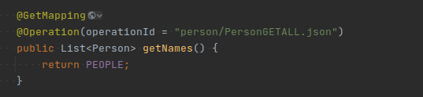
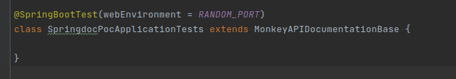
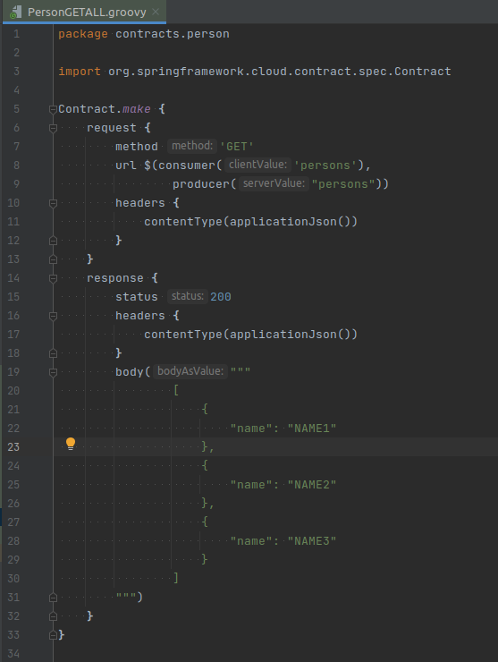
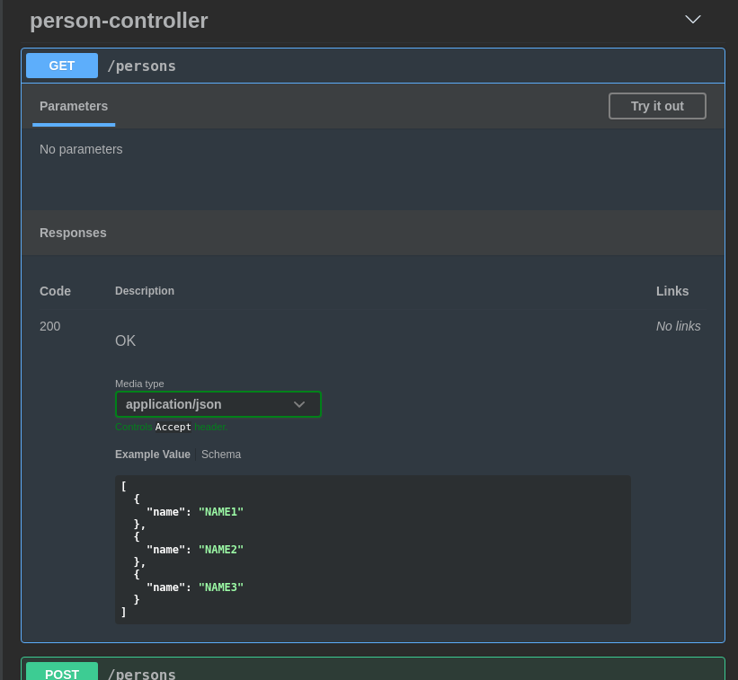

# springdoc-with-contracts
This is a POC to generate [springdoc-openapi](https://springdoc.org/) Request/Response examples based on [spring-cloud-contract](https://spring.io/projects/spring-cloud-contract).

# How achieve this:

1. Add @Operation annotation to RestService and set operationId with the folder and the name of the contract.

   
2. Create SpringBootTest class extending MonkeyAPIDocumentationBase.

3. Run the test and the openapi.json file will be generated on the openapi folder.

   
   
   
##### GET - Contract

##### GET - Documentation

